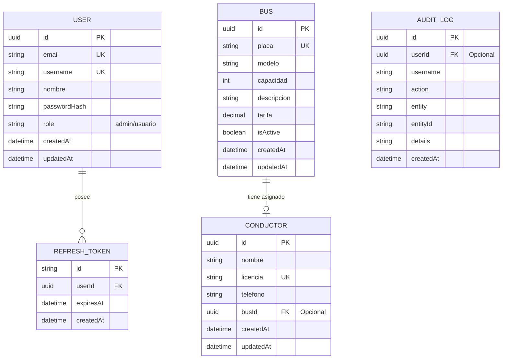
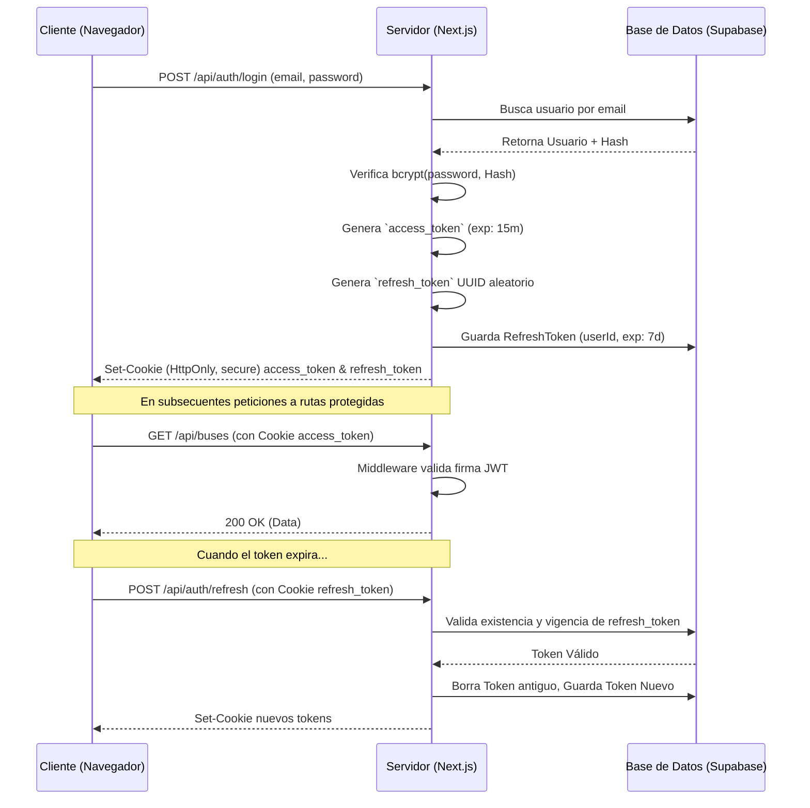

# Sistema Inteligente de Gestión de Flota 🚌

Este es un sistema completo de gestión de flota vehicular construido con Next.js 15, Prisma ORM y Supabase PostgreSQL. Permite la administración integral de buses y conductores con autenticación basada en roles y trazabilidad de operaciones (Auditoría).

## Características Principales

*   **Autenticación JWT:** Login y registro seguros mediante `bcryptjs`, con rotación de `refresh_tokens` guardados en base de datos.
*   **Roles y Autorización:** `admin` (acceso a CRUD completo) y `usuario` (solo lectura). Middleware nativo para protección de rutas.
*   **CRUD Robusto:** Operaciones completas para gestionar Buses y Conductores, con soporte para "Soft Delete" (inactivación) y validaciones severas usando `Zod`.
*   **Auditoría (AuditLog):** Historial automático e inmutable de todas las acciones de creación, actualización y borrado ejecutadas por cualquier usuario.
*   **Base de Datos en la Nube:** Integración mediante Supabase, soportando UUIDs nativos y poolers de conexión para máximo rendimiento.

---

## 🛠️ Instalación y Replicación Local

Sigue estos pasos para levantar el proyecto en tu entorno local:

### 1. Clonar e Instalar
```bash
# Clona el repositorio e ingresa a la carpeta
cd associatebuswithdriver

# Instala todas las dependencias
npm install
```

### 2. Configuración de Entorno
Copia el archivo de ejemplo para crear tu configuración local:
```bash
cp .env.example .env
```
Abre `.env` y configura tus variables. Necesitarás proveer la clave secreta JWT y las conexiones a tu base de datos de Supabase:
*   `DATABASE_URL`: Connection Pooler (Puerto 6543)
*   `DIRECT_URL`: Direct Connection (Puerto 5432)

### 3. Migración y Generación de Prisma
Sincroniza la estructura de la base de datos y genera el cliente local de Prisma 6:
```bash
npx prisma db push
npx prisma generate
```

### 4. Crear Administrador Inicial (Semilla)
Para poder operar los módulos protegidos, crea tu cuenta maestra:
```bash
node scripts/seed-admin.mjs
```
*Tus credenciales serán: `admin@flota.com` / `AdminSecure2026*`*

### 5. Iniciar Servidor
```bash
npm run dev
```
Accede a `http://localhost:3000` en tu navegador.

---

## 📊 Arquitectura de Datos (ER Diagram)



## 🔐 Flujo de Autenticación (JWT)


